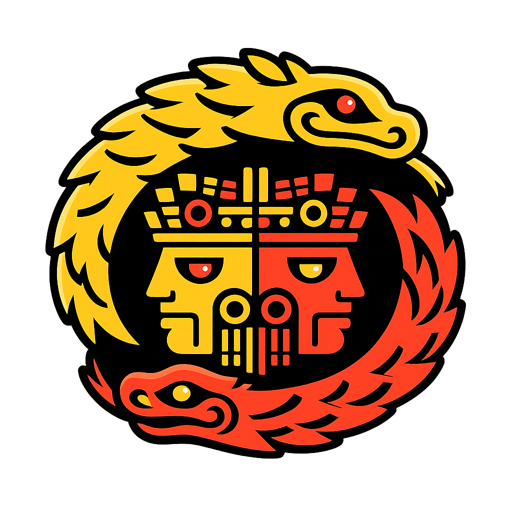
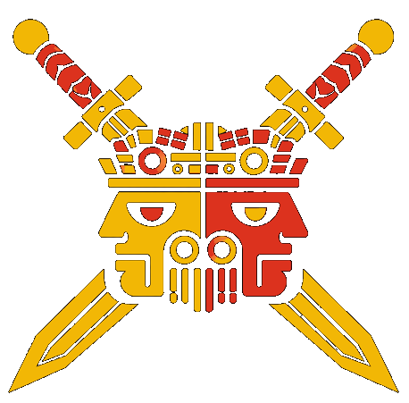
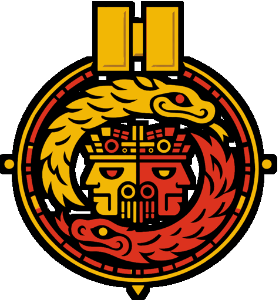
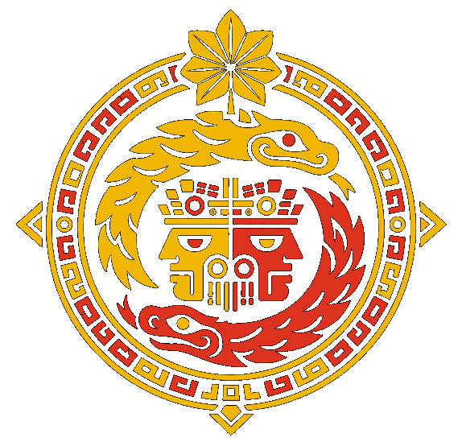
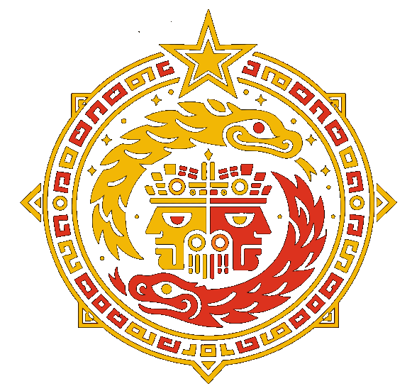
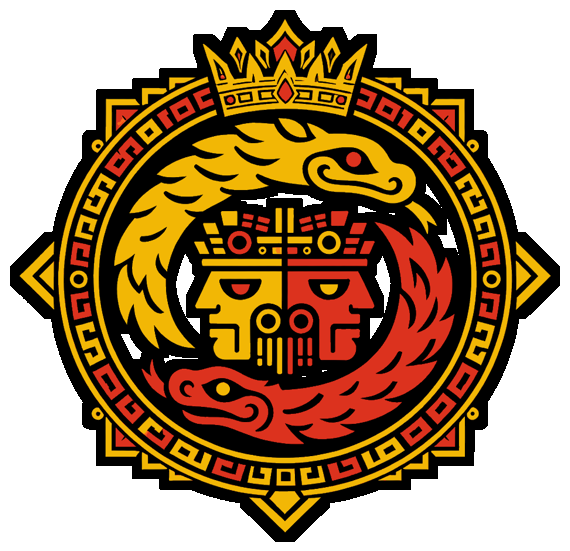
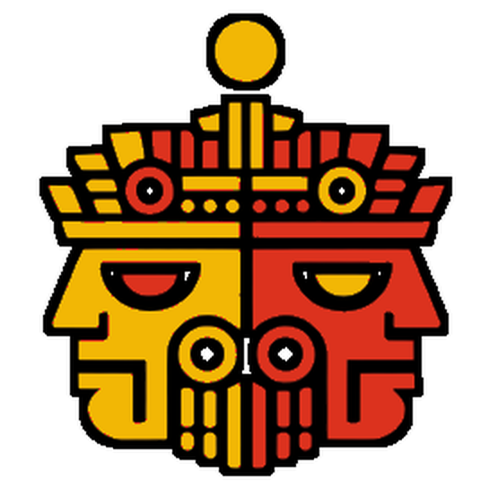
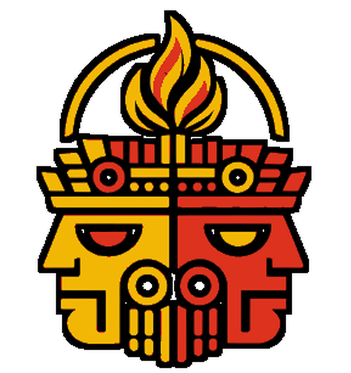
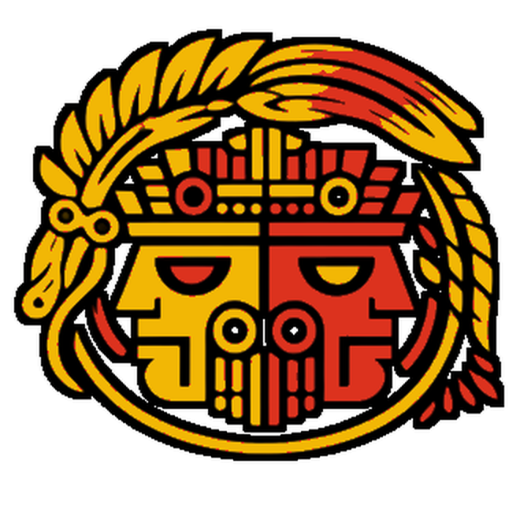

# WORK IN PROGRESS - Under construction

  

# Ometeotl: A Decision Meta-Model in Progress

**Ometeotl** is an experimental Python library for modeling multi-actor, multi-space, multi-metric strategic decision-making systems. Inspired by game theory, axiomatic systems, and neutral teleological modeling, it aims to simulate complex interactions across hierarchical actors, asymmetric temporalities, and perceptual imperfections.

## Cultural Inspiration

The name **Ometeotl** draws from Aztec mythology, where *Ōme* means "two" or "dual" in Nahuatl, and *teōtl* translates to "divinity." Ometeotl embodies the primordial duality—male (Ometecuhtli) and female (Omecihuatl)—as the supreme creator residing in Omeyocan, the "Place of Duality." This concept of inherent duality and generative potential mirrors the library's core philosophy: modeling conflict, cooperation, and emergence from opposing forces in decision spaces.

## Work in Progress

This project is **actively under development**—a true work-in-progress. Current features include foundational axioms, basic serialization (JSON/YAML), and early game theory projections. Full validation pipelines, AI generation tools, and multi-agent simulations are planned for upcoming releases.

## Join the Journey

**All contributions are welcome!** Whether it's code refinements, axiom suggestions, documentation, testing, or cultural insights into the name's resonance, your input will shape Ometeotl. Check the [specs](specs_EN.md), [README](README.md), or [CONTRIBUTING.md](CONTRIBUTING.md) to get started. Fork, PR, or open an issue—let's build this together.

**Start your first PR and become an Eagle Warrior !**

### Developer Ranks - The Path of the Serpent
The Path of the Serpent represents knowledge, depth, and commitment.  
It is the path of those who learn, refine, and wage a quiet, relentless struggle against bad code—both in the system and within themselves.

<table>
<tr>
<td width="160">

</td>
<td>

<h4>Eagle Warrior</h4>

<b>Requirement</b> 
First merged PR  

 

<small><i>
In Nahua warrior tradition, the eagle symbolizes courage, ascent, and the honor of proving oneself in action.
</i></small>

</td>
</tr>

<tr>
<td width="160">

</td>
<td>

<h4>Achcauhtli</h4>

<b>Requirement</b> 
2 to 4 merged PR  

 

<small><i>
Achcauhtli evokes a proven war leader, a contributor who has moved beyond initiation and begun to earn standing through repeated service.
</i></small>

</td>
</tr>

<tr>
<td width="160">

</td>
<td>

<h4>Otomi</h4>

<b>Requirement</b> 
5 to 19 merged PR  

 

<small><i>
The Otomi warrior figure represents resilience and battlefield reputation, honoring contributors who have become dependable forces within the project.
</i></small>

</td>
</tr>

<tr>
<td width="160">

</td>
<td>

<h4>Shorn One</h4>

<b>Requirement</b> 
20+ merged PR  

 

<small><i>
The Shorn Ones were elite warriors sworn not to retreat, making this rank a symbol of exceptional discipline, loyalty, and sustained achievement.
</i></small>

</td>
</tr>

<tr>
<td width="160">

</td>
<td>

<h4>Emperor</h4>

<b>Requirement</b> 
Founder and principal Maintainer.

 

<small><i>
The Emperor stands as the sovereign guardian of the Order, embodying stewardship, vision, and the sacred balance at the heart of Ometeotl.
</i></small>

</td>
</tr>
</table>

### ☀️ Community Benefactors — The Path of the Undying Sun

The Path of the Undying Sun represents clarity, guidance, and transmission.  
It is the path of those who illuminate the way for others and sustain the living flame of knowledge.

 

<table>
<tr>
<td width="160" align="center">

</td>
<td>

<h4>Tlamacazqui — Initiate</h4>

**Requirement**  
Notable contribution to the community

 

<small><i>
Those who begin to carry the light and make their presence felt.
</i></small>

</td>
</tr>

<tr>
<td width="160" align="center">

</td>
<td>

<h4>Tlenamacac — Officiant</h4>

**Requirement**  
Significant contribution to the community

 

<small><i>
Those who sustain the flame and help it grow beyond themselves.
</i></small>

</td>
</tr>

<tr>
<td width="160" align="center">

</td>
<td>

<h4>Quetzalcoatl Priest</h4>
<small><i>High Priest of the Undying Sun</i></small>

**Requirement**  
Decisive contribution to the project or its direction

 

<small><i>
Those whose actions shape the path of others and ensure the light endures.
</i></small>

</td>
</tr>
</table>

