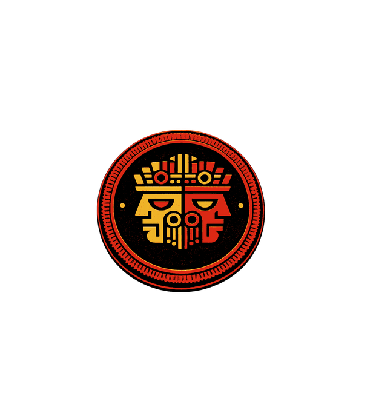
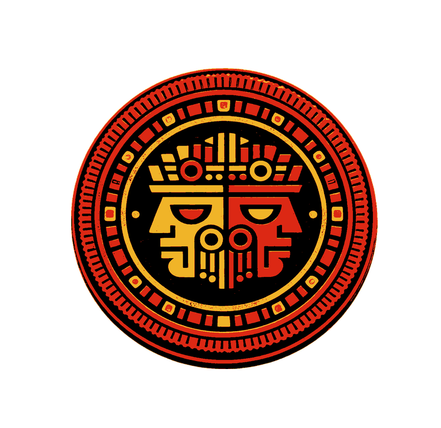
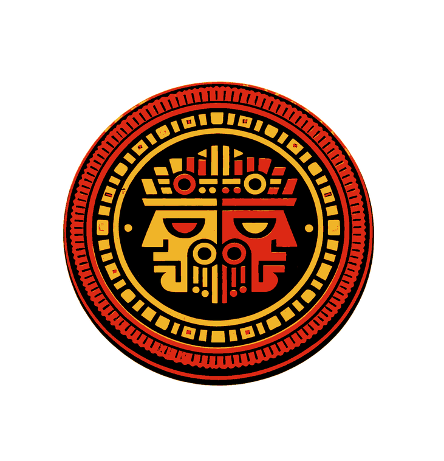
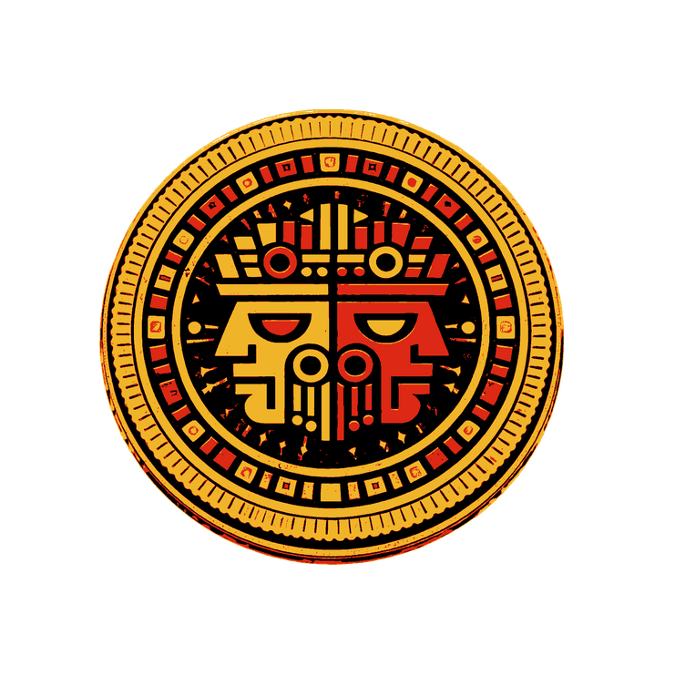
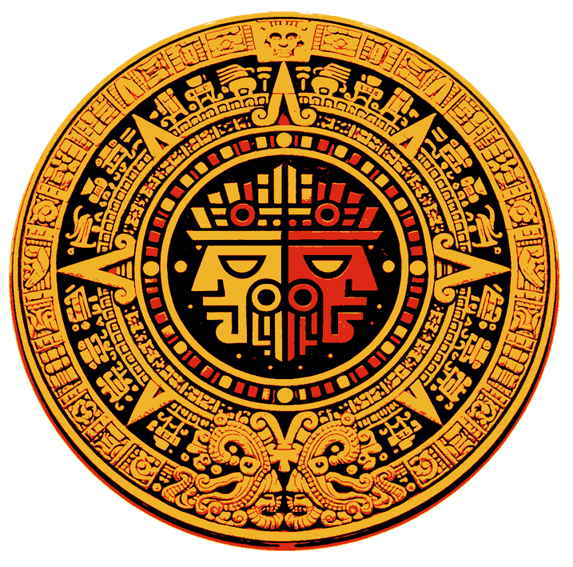

# WORK IN PROGRESS - Under construction

  

# **Ometeotl** : _A Python library to build complex multi-agent simulations, wargames, and AI-driven strategies_
_Create simulated worlds with competitive or cooperative entities using simple class instantiations. Define goals and strategies through clear, standard formats. Train AI agents to act, adapt, and compete in your world. Navigate through a natively built fog of war._

## Ometeotl: An experimental meta-model for complex decisional systems

**Ometeotl** is an experimental Python library for modeling multi-actor, multi-space, multi-metric strategic decision-making systems. Inspired by game theory, axiomatic systems, and neutral teleological modeling, it aims to simulate complex interactions across hierarchical actors, asymmetric temporalities, and perceptual imperfections.

## Cultural Inspiration

The name **Ometeotl** draws from Aztec mythology, where *Ōme* means "two" or "dual" in Nahuatl, and *teōtl* translates to "divinity." Ometeotl embodies the primordial duality—male (Ometecuhtli) and female (Omecihuatl)—as the supreme creator residing in Omeyocan, the "Place of Duality." This concept of inherent duality and generative potential mirrors the library's core philosophy: modeling conflict, cooperation, and emergence from opposing forces in decision spaces.

## Use Cases

- Advanced multi-agent simulations  
- Wargaming and strategic modeling  
- Decision-making benchmarks for symbolic and generative AI  
- Game development and interactive systems  

## Work in Progress

This project is **actively under development**. The current codebase already implements a functional core centered on modeling, perception, projection, strategy, teleology, game-layer utility ranking, composite actors, server-authoritative runtime boundaries, and a dedicated validation layer. Generation, IO packaging, and higher-level examples remain incomplete.

## Current Implementation Status

**04/25/26 - major architectural overhaul:**
  Local tests reveal the current architecture is too abstract for any practical implementation. It has been decided to :
  - to keep the current code in a core module `ometeotl_core`, which is intended to remain abstract;
  - to add a primary layer of specialization `ometeotl_foundations`, including  :
    - spatial: primary layer of spatial implementation of `ometeotl_core`;
    - networks: primary layer of graph theory implementation of `ometeotl_core`
    - ...
  - to add, lastly, an adapter layer `ometeotl_adapters`, which implements each specialization layer with a reputable library.

As of April 2026, the repository includes:

- A full model core in `src/ometeotl_core/model/` with `ModelObject`, `GenericObject`, `Actor`, `Resource`, `Space`, `World`, and registry support.
- Spatial topology with `SpaceObjectGraph`, `SpaceObjectMembership`, `SpaceRelation`, and `SpaceRelationGraph`.
- Composite and abstract actor support with explicit `component` links, composition modes, cycle detection, hierarchy traversal, and abstract-space helpers.
- A perception layer with `Perception`, `PerceivedSpace`, `PerceivedMembership`, `PerceivedRelation`, and `PerceivedComponentLink`.
- A projection layer with `ProjectionAssumption`, `ProjectedPerceptionChange`, `ProjectedPerceptionState`, `ActionProjection`, `ProjectionBatch`, and the default projection tool.
- A strategy layer with strategy nodes, outcome branches, linear and branching builders, and perception-driven chaining.
- A teleology layer with first-class `Goal` objects, decomposition trees, feasibility/admissibility tools, and goal-strategy linkage.
- A utility stack with the abstract `UtilityFunction` interface and concrete game-layer combinators/rankers (`WeightedSumUtility`, `LexicographicUtility`, `StrategyRanker`).
- A sensor pipeline with coverage rules, noise rules, deterministic timestamp-aware perception ids, and epistemic status validation.
- A server-authoritative core runtime with `AuthorityCommandHandler`, command envelopes/results, audit entries, and runtime bootstrap helpers.
- A dedicated validation layer with syntactic, structural, temporal, spatial, admissibility, epistemic, and completeness validators, plus policy-based hardening profiles (`observe_only`, `enforce_structure`, `enforce_domain`) and diagnostics.
- A test suite currently collecting `307` tests across `tests/ometeotl_core/model/`, `tests/ometeotl_core/core/`, `tests/ometeotl_core/game/`, and `tests/ometeotl_core/validation/`.

## Current Architecture

The implemented architecture follows the separation defined in `specs_EN.md`:

- `src/ometeotl_core/model/` contains domain behavior and the canonical object graph.
- `src/ometeotl_core/generic/` contains runtime and authority infrastructure, not domain rules.
- Ontological state lives in `World`, `WorldModelRegistry`, `SpaceObjectGraph`, and `SpaceRelationGraph`.
- Epistemic state lives in `Perception` and its perceived wrappers.
- Projection derives successor perceived states from actions without mutating ontological truth directly.
- Strategy building consumes projected perceptions rather than bypassing the perception layer.
- Goal feasibility/admissibility is model-level and actor-perception grounded, preserving teleological neutrality.
- Game-layer utility/ranking consumes model abstractions without embedding domain constants in core layers.

## Near-Term TODOs

- Implement the `io/` layer for explicit import/export workflows beyond object-local serialization helpers.
- Implement the `generation/` layer and `from_context`-style construction pipeline.
- Extend the `game/` layer beyond current utility/ranking primitives with richer solver-facing abstractions.
- Extend the strategy layer to support one action producing several alternative projected outcomes, with branch-specific successor perceived states carried by `StrategyOutcomeBranch` rather than duplicated on `StrategyNode`.
- Add reference examples and end-to-end demo worlds in `examples/`.
- Continue aligning public docs with the now-implemented projection, strategy, teleology, utility, authority, and composite-actor capabilities.

## Join the Journey

**All contributions are welcome!** Whether it's code refinements, axiom suggestions, documentation, testing, or cultural insights into the name's resonance, your input will shape Ometeotl. Check the [specs](specs_EN.md), [README](README.md), or [CONTRIBUTING.md](CONTRIBUTING.md) to get started. Fork, PR, or open an issue—let's build this together.

**Start your first PR and become an Eagle Warrior !**

### Developer Ranks - The Path of the Serpent
The Path of the Serpent represents knowledge, depth, and commitment.  
It is the path of those who learn, refine, and wage a quiet, relentless struggle against bad code—both in the system and within themselves.

<table>
<tr>
<td width="160" style="text-align:center; vertical-align:middle;">

</td>
<td>

<h4>Eagle Warrior</h4>

<b>Requirement</b> 
First merged PR  

 

<small><i>
In Nahua warrior tradition, the eagle symbolizes courage, ascent, and the honor of proving oneself in action.
</i></small>

</td>
</tr>

<tr>
<td width="160" style="text-align:center; vertical-align:middle;">

</td>
<td>

<h4>Achcauhtli</h4>

<b>Requirement</b> 
2 to 4 merged PR  

 

<small><i>
Achcauhtli evokes a proven war leader, a contributor who has moved beyond initiation and begun to earn standing through repeated service.
</i></small>

</td>
</tr>

<tr>
<td width="160" style="text-align:center; vertical-align:middle;">

</td>
<td>

<h4>Otomi</h4>

<b>Requirement</b> 
5 to 19 merged PR  

 

<small><i>
The Otomi warrior figure represents resilience and battlefield reputation, honoring contributors who have become dependable forces within the project.
</i></small>

</td>
</tr>

<tr>
<td width="160" style="text-align:center; vertical-align:middle;">

</td>
<td>

<h4>Shorn One</h4>

<b>Requirement</b> 
20+ merged PR  

 

<small><i>
The Shorn Ones were elite warriors sworn not to retreat, making this rank a symbol of exceptional discipline, loyalty, and sustained achievement.
</i></small>

</td>
</tr>

<tr>
<td width="160" style="text-align:center; vertical-align:middle;">

</td>
<td>

<h4>Emperor</h4>

<b>Requirement</b> 
Founder and principal Maintainer.

 

<small><i>
The Emperor stands as the sovereign guardian of the Order, embodying stewardship, vision, and the sacred balance at the heart of Ometeotl.
</i></small>

</td>
</tr>
</table>

### Community Benefactors — The Path of the Undying Sun

The Path of the Undying Sun represents clarity, guidance, and transmission.  
It is the path of those who illuminate the way for others and sustain the living flame of knowledge.

 

<table>
<tr>
<td width="160" style="text-align:center; vertical-align:middle;">

</td>
<td>

<h4>Tlamacazqui — Initiate</h4>

**Requirement**  
Notable contribution to the community

 

<small><i>
Those who begin to carry the light and make their presence felt.
</i></small>

</td>
</tr>

<tr>
<td width="160" style="text-align:center; vertical-align:middle;">

</td>
<td>

<h4>Tlenamacac — Officiant</h4>

**Requirement**  
Significant contribution to the community

 

<small><i>
Those who sustain the flame and help it grow beyond themselves.
</i></small>

</td>
</tr>

<tr>
<td width="160" style="text-align:center; vertical-align:middle;">

</td>
<td>

<h4>Quetzalcoatl Priest</h4>
<small><i>High Priest of the Undying Sun</i></small>

**Requirement**  
Decisive contribution to the project or its direction

 

<small><i>
Those whose actions shape the path of others and ensure the light endures.
</i></small>

</td>
</tr>
</table>

### Donors — The Path of the Temple Offering *(available after the first release)*

The Path of the Temple offering represents the material commitment to the project.
It is the path of those who wish to sustain and amplify its development.
Those who walk this this path will support :
- the purchase and maintenance of specific infrastructure
- compensation for those on the path of the serpent, depending on their rank and activity 
- production of merch.

<small><i><b>Historical note:</b> the Aztecs did not use metallic currency—value was expressed through goods, service, and offerings, a principle that inspires this path.</i></small>

<table>
<tr>
<td width="160" style="text-align:center; vertical-align:middle;">

</td>
<td>

<h4>Tonalli Seed</h4>

<small><i>
Those who spark the first motion, bringing initial energy into the system.
</i></small>

</td>
</tr>

<tr>
<td width="160" style="text-align:center; vertical-align:middle;">

</td>
<td>

<h4>Tlaxtli Contributor</h4>

<small><i>
Those who give and sustain, turning intent into tangible support.
</i></small>

</td>
</tr>

<tr>
<td width="160" style="text-align:center; vertical-align:middle;">

</td>
<td>

<h4>Tlatquitl Backer</h4>

<small><i>
Those who provide the substance that allows ideas to take form and endure.
</i></small>

</td>
</tr>

<tr>
<td width="160" style="text-align:center; vertical-align:middle;">

</td>
<td>

<h4>Tonalli Flowkeeper</h4>

<small><i>
Those who maintain the flow, ensuring balance, continuity, and lasting momentum.
</i></small>

</td>
</tr>

<tr>
<td width="160" style="text-align:center; vertical-align:middle;">

</td>
<td>

<h4>Teyolia Source</h4>

<small><i>
Those who stand at the origin, empowering the whole system through their presence.
</i></small>

</td>
</tr>
</table>