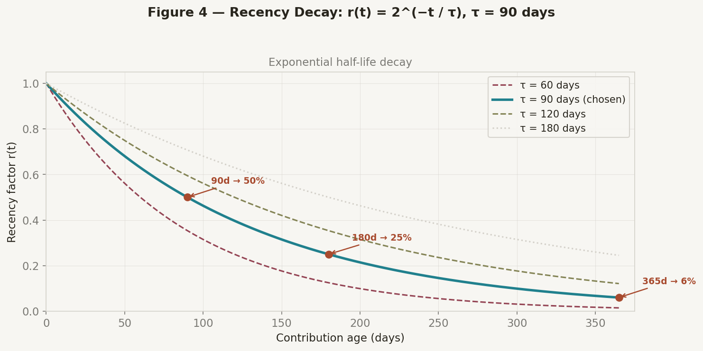
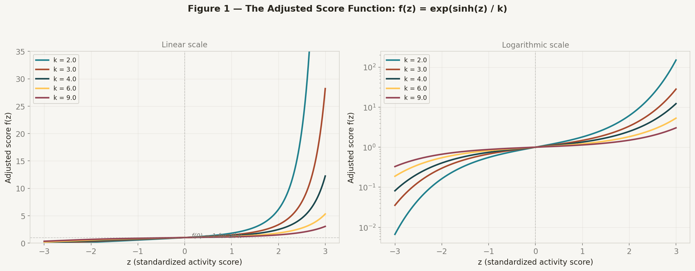
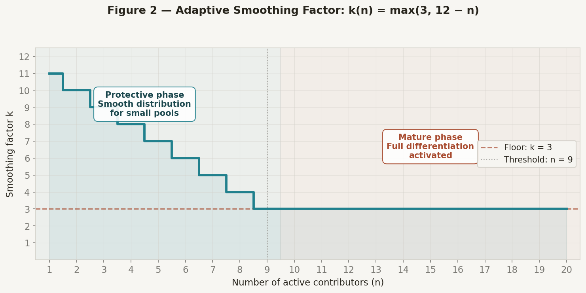
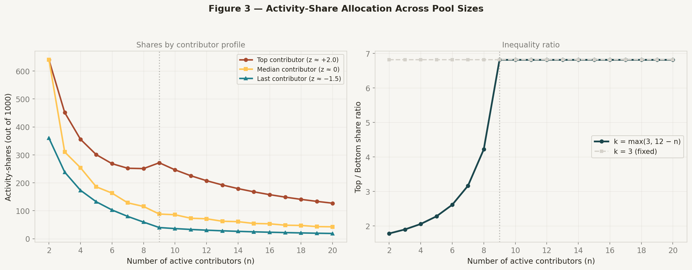

# Ometeotl Activity Leaderboard — Mathematical Specification

> Version 1.0 · April 2026
> Author: @kakchouch (founder)

---

## Table of Contents

1. [Purpose and Design Goals](#1-purpose-and-design-goals)
2. [System Overview](#2-system-overview)
3. [Step 1 — Raw Activity Score](#3-step-1--raw-activity-score)
4. [Step 2 — Standardization (z-score)](#4-step-2--standardization-z-score)
5. [Step 3 — Adjusted Score Function](#5-step-3--adjusted-score-function)
6. [Step 4 — Adaptive Smoothing Factor](#6-step-4--adaptive-smoothing-factor)
7. [Step 5 — Activity-Share Allocation](#7-step-5--activity-share-allocation)
8. [Founder Exclusion Rule](#8-founder-exclusion-rule)
9. [Cold Start Behavior](#9-cold-start-behavior)
10. [Parameter Justification Summary](#10-parameter-justification-summary)
11. [Numerical Reference Tables](#11-numerical-reference-tables)
12. [Security and Transparency](#12-security-and-transparency)
13. [Relationship with the Rank System](#13-relationship-with-the-rank-system)
14. [Configuration Reference](#14-configuration-reference)

---

## 1. Purpose and Design Goals

The Ometeotl Activity Leaderboard distributes **1000 activity-shares** among contributors based on their recent activity. It is designed to satisfy three core goals:

| Goal | Description |
|------|-------------|
| **G1 — Predictability** | An average contributor receives a stable, meaningful share. |
| **G2 — Reward excellence** | Exceptional contributors are generously rewarded, with super-linear returns. |
| **G3 — Symbolic recognition** | Occasional contributors receive a small but non-zero share — never nothing. |

The founder is excluded from share allocation but included in all computations for statistical correctness. The founder's score is displayed out-of-competition as a reference point.

---

## 2. System Overview

The pipeline runs in four stages:

```
Raw Activity Score  →  z-score normalization  →  Adjusted score f(z)  →  Share allocation
     (per user)          (centered, reduced)      (non-linear transform)    (proportional)
```

Each stage is deterministic, reproducible, and parameterized through `leaderboard/config.json`.

---

## 3. Step 1 — Raw Activity Score

### Formula

For each contributor *u*, the raw activity score is:

```
S_raw(u) = Σ  w(e) × r(t_e)
           e ∈ events(u)
```

Where:
- `w(e)` is the weight assigned to event type `e`
- `r(t_e)` is the recency factor for the event's age `t_e` (in days)

### Event Weights

| Event Type | Weight | Justification |
|------------|--------|---------------|
| `merged_pr` | **10** | The primary unit of contribution. A merged PR has passed review, meets quality standards, and directly improves the project. Highest weight. |
| `commit_in_merged_pr` | **3** | Rewards granularity within a PR. A PR with 5 meaningful commits demonstrates iterative work. Capped implicitly by the PR scope. |
| `pr_review` | **4** | Reviewing someone else's code is a high-value activity: it requires understanding the codebase, catches bugs, and mentors the author. Weighted just below a PR because it doesn't produce new code directly. |
| `issue_opened` | **2** | Opening a well-described issue surfaces bugs, proposes features, or asks clarifying questions. Valued above comments but below code contributions. |
| `issue_comment` | **1** | Participating in discussions. Low individual weight, but frequent commenters accumulate meaningful scores. |
| `pr_comment` | **1** | Inline feedback on pull requests. Same logic as issue comments. |
| `lines_changed` | **0.01** per line | A minor bonus for volume, **capped at 500 lines per PR** (contributing max 5 points). This prevents score inflation from large auto-generated or refactoring PRs. Lines changed = additions + deletions. |

### Recency Decay Function

```
r(t) = 2^(−t / τ)       where τ = 90 days (half-life)
```



**Why exponential half-life decay?**

| Property | Explanation |
|----------|-------------|
| **Memoryless** | Each day reduces the score by the same *proportion*, regardless of how old the contribution already is. This is fair and easy to reason about. |
| **Half-life = 90 days** | A contribution retains 50% of its value after 3 months. This matches the natural rhythm of open-source projects: quarterly releases, seasonal activity patterns. |
| **Never zero** | `r(t) > 0` for all `t`. Even a year-old contribution still counts for ~6%, ensuring historical contributors are not entirely erased. |
| **Standard practice** | Half-life decay is used by GitHub's contribution graphs, GitLab's activity scoring, and most reputation systems (Stack Overflow, Reddit). |

**Why τ = 90 specifically?**

| Half-life | 30-day-old contribution | 90-day-old | 180-day-old | Character |
|-----------|------------------------|------------|-------------|-----------|
| 60 days | 70.7% | 35.4% | 12.5% | Aggressive — punishes pauses |
| **90 days** | **79.4%** | **50.0%** | **25.0%** | **Balanced — quarterly rhythm** |
| 120 days | 84.1% | 59.5% | 35.4% | Lenient — slow decay |
| 180 days | 89.1% | 70.7% | 50.0% | Very lenient — favors incumbents |

τ = 90 is the sweet spot: recent contributors are clearly favored, but a break of a few weeks barely affects the score. A 3-month sabbatical halves the score — significant but not devastating.

---

## 4. Step 2 — Standardization (z-score)

### Formula

For the set of **all** raw scores `{S_raw(u₁), S_raw(u₂), ..., S_raw(uₙ)}` (founder included):

```
z(u) = (S_raw(u) − μ) / σ
```

Where:
- `μ = mean(S_raw)` — arithmetic mean of all raw scores
- `σ = std(S_raw, ddof=1)` — sample standard deviation (Bessel's correction)

### Why standardize?

1. **Removes scale dependence**: raw scores depend on project size and age. The z-score is dimensionless and comparable across time.
2. **Centers the distribution**: `z = 0` always means "average contributor", regardless of the absolute activity level.
3. **Enables the adjusted score function**: `f(z)` is designed to operate on a standard normal-like input where `z ∈ [-3, +3]` covers ~99.7% of cases.

### Why include the founder in normalization?

The founder is typically the most active contributor, especially in early project stages. Excluding them from the mean/std computation would artificially inflate all other z-scores (since μ would be lower and σ would shrink). Including them ensures the z-scores are statistically honest. The founder is excluded only at the final share allocation step.

### Edge case: σ = 0

If all contributors have the same raw score (or there is only one contributor), `σ = 0` and division is undefined. In this case, all z-scores are set to `0.0`, and shares are distributed equally.

---

## 5. Step 3 — Adjusted Score Function

### Formula

```
f(z) = exp(sinh(z_clamped) / k)
```

Where:
- `z_clamped = clamp(z, −3, +4)`
- `k` is the adaptive smoothing factor (see Step 4)



### Why this specific function?

The function `exp(sinh(z)/k)` was chosen for a precise set of mathematical properties that align with the design goals:

#### Property 1 — Invariant anchor at z = 0

```
f(0) = exp(sinh(0)/k) = exp(0) = 1    for all k
```

The average contributor always has an adjusted score of exactly 1. This is the stable reference point that makes the system predictable (Goal G1). No matter how k changes, the average contributor's relative position is anchored.

#### Property 2 — Asymmetric amplification

For `z > 0` (above-average contributors):
- `sinh(z) ≈ eᶻ/2` for large z, so `f(z) ≈ exp(eᶻ / 2k)`
- This is a **double exponential** — super-linear reward for exceptional contributors (Goal G2)

For `z < 0` (below-average contributors):
- `sinh(z) ≈ −e⁻ᶻ/2` for large negative z, so `f(z) ≈ exp(−e⁻ᶻ / 2k)`
- This approaches 0 but **never reaches it** — symbolic recognition is preserved (Goal G3)

#### Property 3 — Single-parameter control

The entire behavior of the function is governed by one parameter `k`:
- Small k → aggressive differentiation (stars get much more)
- Large k → smooth distribution (everyone is closer)

This makes the system easy to tune without structural changes.

#### Property 4 — Always positive

`exp(x) > 0` for all `x ∈ ℝ`. No contributor can ever receive zero or negative shares.

#### Property 5 — Monotonically increasing

`f'(z) = f(z) × cosh(z) / k > 0` for all z. Higher activity always means higher score. There are no inversions or local maxima.

### Why not simpler alternatives?

| Alternative | Problem |
|-------------|---------|
| `exp(z/k)` | Linear sensitivity — does not amplify outliers enough. A z=+3 contributor gets only 2.7× the average (with k=3), not 28×. |
| `z²` or `z³` | Negative for negative z, or zero at z=0. Breaks the share allocation. |
| `exp(z²/k)` | Symmetric — punishes below-average contributors as harshly as it rewards above-average ones. Also not monotonic (same score for z=+2 and z=-2). |
| `exp(z³/k)` | Grows too fast (z=3 → exp(9) ≈ 8103 with k=1). Very difficult to control. |
| Piecewise functions | Introduce arbitrary breakpoints. Less elegant, harder to justify, and create discontinuities in the derivative. |

### z-score clamping: why [-3, +4]?

| Bound | Justification |
|-------|---------------|
| `z_min = -3` | In a standard normal distribution, z < -3 occurs with probability 0.13%. Clamping here has virtually no statistical impact and prevents `f(z)` from producing extremely small values that would round to 0 shares. |
| `z_max = +4` | Prevents numerical overflow. With k=3, `f(4)` ≈ 8,930 — large but manageable. Without clamping, `f(5)` ≈ 5.5 × 10¹⁰, which would give one contributor >99.99% of all shares. The asymmetric bound (+4 vs -3) reflects the asymmetric nature of `sinh`: positive overflow is more dangerous. |

---

## 6. Step 4 — Adaptive Smoothing Factor

### Formula

```
k = max(3, 12 − n_active)
```

Where `n_active` is the number of **active contributors** (at least one scored event within the last 180 days, i.e., 2× the half-life).



### Behavior

| n_active | k | Phase |
|----------|---|-------|
| 1 | 11 | Protective |
| 2 | 10 | Protective |
| 3 | 9 | Protective |
| 4 | 8 | Protective |
| 5 | 7 | Protective |
| 6 | 6 | Transitional |
| 7 | 5 | Transitional |
| 8 | 4 | Transitional |
| 9+ | **3** | **Mature (floor)** |

### Why adaptive k?

**The core problem**: with a fixed k, the same differentiation is applied whether the project has 2 contributors or 200. In a small pool, this creates pathological outcomes:

| Scenario (k=3 fixed) | Top contributor share | Problem |
|-----------------------|----------------------|---------|
| 2 contributors, one active + one occasional | ~87% vs ~13% | The active contributor monopolizes the leaderboard. Not motivating for the occasional one. |
| 3 contributors, one star + two average | ~65% vs ~17.5% each | One person dominates despite only 3 data points. |

**The adaptive solution**: when the pool is small, k is high, producing a smoother distribution that feels fair. As the community grows and the z-score becomes statistically meaningful, k decreases to its floor, activating full differentiation.

### Why these specific parameters?

#### Floor: k = 3

At k = 3, the function provides strong but bounded differentiation:
- A z=+2 contributor gets 3.35× the score of z=0 (average)
- A z=-2 contributor gets 0.30× the score of z=0
- The ratio between z=+2 and z=-2 is ~11.2×
- `f(4)` ≈ 8,930 — no overflow risk

k = 2 would be more aggressive (ratio ~37.6×) but risks one contributor capturing >60% of shares.
k = 4 would be gentler (ratio ~6.1×) but under-rewards exceptional contributors.

#### Offset: 12

The choice of 12 (rather than 10 or 15) is driven by the transition point:
- `12 − n = 3` when `n = 9`
- At 9 active contributors, the z-score is statistically robust (the sample standard deviation stabilizes around n ≈ 8-10 for most distributions)
- The protective phase covers `n ∈ [1, 8]`, which is the typical early growth period of an open-source project

With offset = 10, the floor would be reached at n = 7 — arguably too early.
With offset = 15, the floor would be reached at n = 12 — too protective, delaying reward differentiation.

#### Active contributor window: 180 days

A contributor is "active" if they have at least one scored event in the last 180 days (2× the recency half-life). This ensures:
- A contributor who stopped 6 months ago (whose remaining recency factor is ~25%) is excluded from the count
- The active count reflects the *current* community size, not the historical one
- The 2× half-life threshold is a natural cutoff: after 2 half-lives, the contribution's remaining weight is ≤ 25%

---

## 7. Step 5 — Activity-Share Allocation

### Formula

For each contributor `u` (excluding the founder):

```
shares(u) = floor_to_1dp( (f(z(u)) / Σ f(z(uᵢ))) × 1000 )
```

Where the sum in the denominator runs over all non-founder contributors.



### Properties

- Shares are always positive (`f(z) > 0`)
- Shares sum to 1000 (with minor rounding adjustments)
- The allocation is zero-sum: if one contributor's share increases, others decrease proportionally
- Shares are recomputed daily (recency factors change) and on every merged PR

### Rounding

Shares are rounded to 1 decimal place. Any residual from rounding (typically < 1 share) is added to the contributor with the largest share.

---

## 8. Founder Exclusion Rule

The founder (`kakchouch`) is:

| Stage | Included? | Reason |
|-------|-----------|--------|
| Raw score computation | Yes | Needed for accurate data |
| z-score normalization | **Yes** | The founder's score affects μ and σ. Excluding it would artificially inflate other z-scores. |
| Adjusted score computation | Yes | Computed for display purposes |
| **Share allocation** | **No** | The founder's shares are shown as "theoretical (out-of-competition)" but not deducted from the 1000 pool. |

This ensures: (1) the mathematical model is statistically correct, (2) other contributors see their real position relative to the full distribution, and (3) the founder doesn't compete with their own community.

---

## 9. Cold Start Behavior

When there are fewer than 3 active contributors (excluding the founder), the z-score is unreliable (one or two data points cannot produce a meaningful standard deviation).

**Fallback rule**: if `n_active < 3` (founder excluded), shares are allocated proportionally to raw scores:

```
shares(u) = (S_raw(u) / Σ S_raw(uᵢ)) × 1000
```

This simple proportional allocation requires no normalization and degrades gracefully to equal shares if all contributors have the same raw score.

The threshold of 3 is the minimum for a z-score to have any statistical meaning (you need at least 3 points to compute a non-degenerate standard deviation).

---

## 10. Parameter Justification Summary

| Parameter | Value | Primary Justification | Sensitivity |
|-----------|-------|----------------------|-------------|
| Total shares | 1000 | Round number, high enough for fine-grained allocation | Cosmetic only — does not affect relative distribution |
| k floor | 3 | Optimal differentiation/equity balance (see §6) | k=2 too aggressive, k=4 too flat |
| k offset | 12 | Transition at n=9 aligns with z-score stability | ±2 is reasonable; 12 is the balanced choice |
| z clamp | [-3, +4] | Overflow protection + anti-monopoly | Asymmetric by design; could extend to [-4, +5] safely |
| Half-life τ | 90 days | Quarterly rhythm, standard in industry | 60d punishes pauses, 120d favors incumbents |
| Active window | 180 days | 2× half-life, natural cutoff at 25% residual weight | Directly tied to τ; change τ → change window |
| Merged PR weight | 10 | Highest-value contribution type | Anchor weight; all others relative to this |
| PR review weight | 4 | ~40% of a PR — high value, no new code | Could be 3-5 depending on review culture |
| Lines changed cap | 500/PR | Prevents gaming via large refactors or auto-gen | 200-1000 range is reasonable |
| Min contributors for z | 3 | Minimum for non-degenerate std deviation | Mathematical minimum |

---

## 11. Numerical Reference Tables

### Adjusted score f(z) for key k values

| z | k=3 (mature) | k=5 (n=7) | k=7 (n=5) | k=9 (n=3) | k=11 (n=1) |
|---|---|---|---|---|---|
| -3.0 | 0.056 | 0.268 | 0.433 | 0.539 | 0.609 |
| -2.0 | 0.299 | 0.484 | 0.609 | 0.689 | 0.739 |
| -1.0 | 0.676 | 0.791 | 0.845 | 0.876 | 0.895 |
| 0.0 | **1.000** | **1.000** | **1.000** | **1.000** | **1.000** |
| +1.0 | 1.480 | 1.265 | 1.183 | 1.138 | 1.112 |
| +2.0 | 3.350 | 2.065 | 1.679 | 1.497 | 1.394 |
| +3.0 | 28.20 | 7.416 | 3.781 | 2.713 | 2.208 |

### Share allocation example (9 contributors, k=3)

| Rank | z-score | Adjusted score | Shares |
|------|---------|---------------|--------|
| 1 | +2.50 | 7.514 | 433.2 |
| 2 | +1.94 | 3.105 | 179.0 |
| 3 | +1.38 | 1.853 | 106.9 |
| 4 | +0.81 | 1.352 | 78.0 |
| 5 | +0.25 | 1.088 | 62.7 |
| 6 | -0.31 | 0.900 | 51.9 |
| 7 | -0.88 | 0.719 | 41.4 |
| 8 | -1.44 | 0.516 | 29.7 |
| 9 | -2.00 | 0.299 | 17.2 |

---

## 12. Security and Transparency

### Anti-gaming measures

| Attack vector | Mitigation |
|---------------|-----------|
| Spam PRs with trivial changes | PRs must be **merged** (implies maintainer review). Trivial PRs will be rejected during review. |
| Inflated line counts | Lines changed capped at 500 per PR (max 5 points per PR from this dimension). |
| Self-merging (non-founder) | Branch protection rules require at least 1 approving review. |
| Bot accounts | Only human contributors with merged PRs are included. Bot accounts (`*[bot]`) are excluded. |
| Score manipulation via issues | Issues and comments have low weight (1-2). Gaming them is unprofitable. |

### Auditability

- `leaderboard/config.json` is version-controlled — every parameter change is tracked in git history
- `leaderboard/leaderboard-data.json` exports all raw scores, z-scores, adjusted scores, and share allocations after each computation
- The formula is public and deterministic: anyone can reproduce the results from the GitHub API data

---

## 13. Relationship with the Rank System

The leaderboard (activity-shares) is **complementary** to the existing rank system (Path of the Serpent):

| Dimension | Rank System | Activity Leaderboard |
|-----------|-------------|---------------------|
| Nature | Lifetime milestone | Dynamic snapshot |
| Based on | Total merged PR count | Weighted, recency-adjusted activity |
| Progression | Monotonic (only goes up) | Fluctuates with activity |
| Purpose | Status and identity | Incentive and recognition |
| Examples | Eagle Warrior (1 PR), Otomi (5 PRs) | 147.3 shares (14.7%) |

A contributor can be an **Otomi** (high rank from historical contributions) while having few current activity-shares (if they've been inactive recently). Conversely, a new **Eagle Warrior** with a single but recent, high-impact PR might temporarily hold more shares than a dormant Shorn One.

Both systems coexist in `CONTRIBUTORS.md` and on the documentation site.

---

## 14. Configuration Reference

All parameters live in `leaderboard/config.json`:

```json
{
  "founder": "kakchouch",
  "total_shares": 1000,
  "k_floor": 3,
  "k_offset": 12,
  "z_clamp_min": -3.0,
  "z_clamp_max": 4.0,
  "half_life_days": 90,
  "active_contributor_window_days": 180,
  "min_active_contributors_for_z_score": 3,
  "weights": {
    "merged_pr": 10,
    "pr_review": 4,
    "issue_opened": 2,
    "issue_comment": 1,
    "pr_comment": 1,
    "commit_in_merged_pr": 3,
    "lines_changed_per_unit": 0.01,
    "lines_changed_cap_per_pr": 500
  }
}
```

To modify any parameter: edit `config.json`, commit, and the next leaderboard computation will use the new values. No code changes required.
